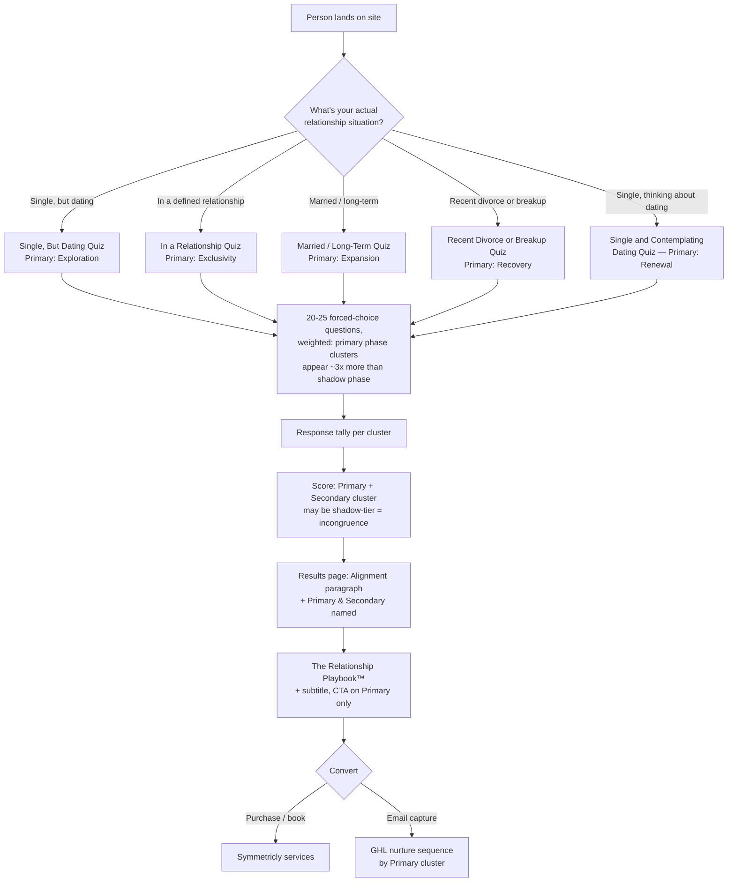

# Relationship Snapshot — Technical Architecture

This maps everything in `RLC_Experience_Clusters.xlsx` (source workbook — see `/data` for seed-ready JSON exports, don't hand-transcribe from Excel) onto your existing stack (Next.js/TypeScript, Supabase, Netlify). Nothing here requires new infrastructure — it's new tables, new routes, and a scoring function on top of what you've already got.

---

## 1. The flow, end to end



Each marker is structurally what someone would check on an intake form — not a phase they have to guess. The quiz then blends their expected phase's content with one "shadow" phase, so someone who's married but relationally checked out isn't structurally walled off from an Expiration result just because they picked "married." Full mapping in Section 6.

---

## 2. Data model (Supabase / Postgres)

This is a direct port of the workbook's tabs into tables. Five tables cover the whole system.

```sql
-- ============================================================
-- 1. CLUSTERS — one row per Cluster Framework entry (27 rows — see CLAUDE.md,
-- "Cluster 27" section, for the one cluster built differently from the rest)
-- ============================================================
create table snapshot_clusters (
  id smallint primary key,                 -- 1-27, matches the workbook
  name text not null,                      -- "Difficulty Feeling Chosen"
  core_challenge text not null,            -- the "in their words" line
  description text not null,               -- backend explanation
  unmet_need text not null,                -- one of the 10 Fundamental Needs
  underlying_fear text not null,
  playbook_subtitle text not null,         -- "For Rebuilding Confidence After..."
  alignment_paragraph text not null,       -- shown to the person in their report
  content_pillars jsonb not null,          -- array of 4 strings, backend use
  is_assessable boolean not null default true  -- FALSE for Clusters 2 & 17
);

-- ============================================================
-- 2. ASSESSMENTS — one row per structural marker (6 rows)
-- CHANGED FROM PURE PHASE QUIZZES: a marker is a structural life
-- situation (e.g. "married," "recently ended"), not a phase. Each
-- marker maps to a PRIMARY phase (the structurally expected content)
-- and a SHADOW phase (the most realistic incongruence pattern for
-- that situation — e.g. Married's shadow is Expiration, because a
-- structurally intact marriage can still be relationally ending).
-- This is what lets a married person's answers surface Expiration
-- content instead of being walled off from it by their marker choice.
-- ============================================================
create table snapshot_assessments (
  id text primary key,                     -- 'not_in_relationship' | 'not_yet_exclusive' | 'married_or_committed' | 'separating' | 'recently_ended' | 're_entering'
  display_name text not null,              -- "Married or Committed"
  entry_prompt text not null,              -- the self-selection copy shown on the picker
  question_count smallint not null,        -- varies 20-25 by marker, scales with combined cluster count
  primary_phase text not null,             -- for reference/docs — not queried at runtime
  shadow_phase text not null
);

-- ============================================================
-- 3. QUIZ ITEMS — the curated statement bank per cluster (up to 20)
-- ============================================================
create table snapshot_quiz_items (
  id uuid primary key default gen_random_uuid(),
  cluster_id smallint references snapshot_clusters(id) not null,
  statement text not null,
  context text  -- null for almost every cluster; Cluster 24 only, values
                 -- 'pre_definition' | 'post_definition' — see CLAUDE.md,
                 -- "Cluster 24 is a special case." Slot resolution for
                 -- Cluster 24 MUST filter by context matching the marker.
);

-- which clusters are valid outcomes for which marker, AND whether
-- that cluster is primary (expected) or shadow (incongruence signal)
-- for this specific marker — this tier is what the weighted question
-- generation was built against, and it's also useful at read-time
-- (e.g. flag to a clinician when someone's result was a shadow-tier
-- cluster, since that's the incongruence signal worth their attention)
create table snapshot_assessment_clusters (
  assessment_id text references snapshot_assessments(id),
  cluster_id smallint references snapshot_clusters(id),
  tier text not null check (tier in ('primary', 'shadow')),
  primary key (assessment_id, cluster_id)
);

-- ============================================================
-- 4. QUIZ QUESTIONS — the pre-built, validated question STRUCTURE
-- (20-25 questions depending on marker — see Section 6 for exact
-- counts and why they differ). The structure (which cluster in which
-- question, how many options, weighted balance between primary and
-- shadow clusters) is pre-built and validated offline. A "slot" points
-- to a CLUSTER, not one fixed statement — the actual statement shown
-- is chosen at session-start from that cluster's expanded item pool
-- (up to 20 per cluster, was 8-10) — so the skeleton never changes,
-- but the wording is different most times someone takes the quiz.
-- ============================================================
create table snapshot_quiz_questions (
  id uuid primary key default gen_random_uuid(),
  assessment_id text references snapshot_assessments(id) not null,
  question_order smallint not null,
  option_count smallint not null           -- always 5 now (was alternating 4/5, changed after
                                            -- a real coverage gap was spotted live: Married's 12
                                            -- primary clusters meant some 4-option questions
                                            -- showed nothing a given person related to)
);

create table snapshot_quiz_question_slots (
  id uuid primary key default gen_random_uuid(),
  question_id uuid references snapshot_quiz_questions(id) not null,
  cluster_id smallint references snapshot_clusters(id) not null,  -- NOT a fixed statement anymore
  slot_order smallint not null             -- display order within the question
);

-- ============================================================
-- 5. RESPONSES — one row per test-taker session
-- DECIDED: email is captured only at conversion (CTA click), not at quiz
-- start. user_id is null until they convert and create/claim a portal
-- account; that account is what gives them the PDF later.
-- ============================================================
create table snapshot_quiz_sessions (
  id uuid primary key default gen_random_uuid(),
  assessment_id text references snapshot_assessments(id) not null,
  contact_email text,                      -- null until conversion (CTA click), never required to start the quiz
  user_id uuid references auth.users(id),  -- null until they create/claim a portal account at conversion
  started_at timestamptz not null default now(),
  completed_at timestamptz,
  primary_cluster_id smallint references snapshot_clusters(id),
  secondary_cluster_id smallint references snapshot_clusters(id),
  is_tied boolean not null default false,  -- flags the co-primary edge case
  converted_at timestamptz,                -- when they hit the CTA and captured email
  pdf_storage_path text,                   -- Supabase Storage path to their generated Playbook PDF
  pdf_generated_at timestamptz,
  neutral_answer_count smallint not null default 0,  -- how many "None of these fit" picks
  is_low_confidence boolean not null default false    -- computed at scoring time, see Section 3
);

-- NEW: generated once, at the moment a session starts — locks in which
-- specific statement was shown for each slot, so (a) scoring and analytics
-- know exactly what was displayed, and (b) if someone navigates back to a
-- previous question, they see the same statement, not a re-randomized one.
create table snapshot_quiz_session_items (
  session_id uuid references snapshot_quiz_sessions(id) not null,
  slot_id uuid references snapshot_quiz_question_slots(id) not null,
  shown_item_id uuid references snapshot_quiz_items(id) not null,
  primary key (session_id, slot_id)
);

-- "None of these fit" is a 6th option the APP always renders on every
-- question — it is NOT part of the pre-built, validated 5-option question
-- structure and is never stored in snapshot_quiz_question_slots. Selecting
-- it means selected_slot_id is null and is_neutral is true. This keeps the
-- validated question data completely untouched by this feature.
create table snapshot_quiz_answers (
  session_id uuid references snapshot_quiz_sessions(id) not null,
  question_id uuid references snapshot_quiz_questions(id) not null,
  selected_slot_id uuid references snapshot_quiz_question_slots(id),  -- null when is_neutral is true
  is_neutral boolean not null default false,
  answered_at timestamptz not null default now(),
  primary key (session_id, question_id),
  check (is_neutral = true or selected_slot_id is not null)
);
```

**How alternation actually works, end to end:** each marker's question skeleton (which cluster appears in which question, how many options, the weighted balance between primary and shadow clusters — see Section 6) is generated and validated offline by `build_marker_quizzes.py`, not `build_quiz_v2.py` (superseded — the old version assumed pure phase quizzes with equal weighting, before structural markers existed). That skeleton never changes and never runs live. What's new: when a session starts, the app rolls once per slot — for each `snapshot_quiz_question_slot`, randomly pick one `snapshot_quiz_item` belonging to that slot's cluster, and write it to `snapshot_quiz_session_items`. That's the only new logic, and it's simple (a random pick from a pre-approved list, not a balancing algorithm) — so it's safe to run live without the risk the original "don't regenerate" warning was about.

**The one real constraint this doesn't solve:** Cluster 26 only has 10 total statements in its pool (vs. up to 20 for most others) — it'll show noticeably less variety across repeat quiz-takers no matter how this is built. Not a bug, just a ceiling on how much content actually exists for that cluster.

---

## 3. Scoring logic

This is the one piece of real application code. Runs when a session is marked complete.

```typescript
// lib/rlc/scoreSession.ts

interface AnswerTally {
  clusterId: number;
  wins: number;
}

// Low-confidence threshold: if someone picks "None of these fit" on more
// than 40% of questions, their Primary/Secondary result is built on
// noticeably less signal than a typical session. Flagged, not blocked —
// still show a result, just mark it so the results page (or a future
// clinical surface) can handle it differently if desired.
const LOW_CONFIDENCE_NEUTRAL_RATIO = 0.4;

async function scoreSession(sessionId: string) {
  const answers = await supabase
    .from('snapshot_quiz_answers')
    .select(`
      selected_slot_id,
      is_neutral,
      snapshot_quiz_question_slots(cluster_id)
    `)
    .eq('session_id', sessionId);

  const allAnswers = answers.data ?? [];
  const neutralCount = allAnswers.filter(a => a.is_neutral).length;

  const tally = new Map<number, number>();
  for (const a of allAnswers) {
    if (a.is_neutral) continue;  // neutral answers never count toward any cluster
    const clusterId = a.snapshot_quiz_question_slots.cluster_id;
    tally.set(clusterId, (tally.get(clusterId) ?? 0) + 1);
  }

  const ranked = [...tally.entries()]
    .sort((a, b) => b[1] - a[1])
    .map(([clusterId, wins]) => ({ clusterId, wins }));

  const isTied = ranked.length > 1 && ranked[0].wins === ranked[1].wins;
  const isLowConfidence = allAnswers.length > 0
    && (neutralCount / allAnswers.length) > LOW_CONFIDENCE_NEUTRAL_RATIO;

  await supabase.from('snapshot_quiz_sessions').update({
    completed_at: new Date().toISOString(),
    primary_cluster_id: ranked[0]?.clusterId,
    secondary_cluster_id: isTied ? null : ranked[1]?.clusterId,
    is_tied: isTied,
    neutral_answer_count: neutralCount,
    is_low_confidence: isLowConfidence,
  }).eq('id', sessionId);

  return { primary: ranked[0], secondary: isTied ? null : ranked[1], isTied, isLowConfidence };
}
```

**The tie case, made concrete:** if `isTied` is true, your two options from the workbook's methodology note are: (a) show both as co-Primary with two Playbook CTAs, or (b) fire one extra head-to-head question between just the tied clusters' remaining unused statements before finalizing. Given Expiration and Recovery are your smallest quizzes (most likely to tie), I'd build (b) — a `resolveTie(sessionId)` function that pulls one more question from `snapshot_quiz_items` for just those two clusters — since a shared-Primary result is a weaker product moment than a clean single answer.

**"None of these fit" — why it exists and the tradeoff that comes with it:** every question is capped at 5 statement options; with markers like Married (12 primary clusters), any single question can genuinely show nothing that resonates with a given person. Rather than force a pick, a 6th option is always available. The tradeoff, worth understanding rather than just implementing: someone who uses this heavily is answering fewer real questions than everyone else, so their result is built on thinner signal — and the people most likely to lean on it aren't random, they tend to be people with a milder or more ambivalent version of a pattern (someone with a strong, clear experience almost always finds something that resonates; someone in a subtler version of the same thing is the one most likely to shrug). `is_low_confidence` and `neutral_answer_count` exist specifically so this isn't an invisible problem — the data needed to know when a result is less reliable is captured, even though what to *do* with that flag on the results page is still an open product decision (soften the framing, suggest a different marker, or nothing at all) — don't invent an answer to that, ask.

---

## 4. The results page

Route: `/results/[sessionId]` (or embed in the quiz flow as a final step, no separate URL if you don't want results shareable/bookmarkable).

```
┌─────────────────────────────────────────┐
│  [Alignment paragraph for Primary]        │  ← snapshot_clusters.alignment_paragraph
│                                            │
│  You may also relate to: [Secondary name] │  ← short, no CTA, just named
│                                            │
│  ┌───────────────────────────────────┐   │
│  │  The Relationship Playbook™        │   │  ← snapshot_clusters.playbook_subtitle
│  │  [Primary's subtitle]              │   │
│  │                                     │   │
│  │  [Get Your Playbook →]  ← CTA      │   │  ← ONLY points at Primary
│  └───────────────────────────────────┘   │
└─────────────────────────────────────────┘
```

The query for this page is one join:

```typescript
const { data: session } = await supabase
  .from('snapshot_quiz_sessions')
  .select(`
    primary_cluster_id, secondary_cluster_id, is_tied,
    primary:snapshot_clusters!primary_cluster_id(*),
    secondary:snapshot_clusters!secondary_cluster_id(*)
  `)
  .eq('id', sessionId)
  .single();
```

---

## 5. Product decisions — resolved

**A. Playbook delivery: PDF, accessed through a client portal.**
Requires a real account, not just an anonymous session — `snapshot_quiz_sessions.user_id` links to Supabase Auth once someone converts. Two implementation paths, worth a deliberate choice rather than defaulting:
  - **Pre-generated (recommended to start):** since Playbook content is per-cluster, not per-person, render all 27 PDFs once (from `clusters.json`'s `playbook_title` / `playbook_subtitle` / `alignment_paragraph`) and just serve the right static file based on `primary_cluster_id`. Cheap, fast, no runtime rendering risk.
  - **Dynamic:** generate per-session at conversion time, which is the only way to personalize it (e.g. insert their name). More moving parts (PDF rendering service, storage write, failure handling). Only worth it if personalization is a real requirement — confirm before building this path.

**B. Email: captured only at conversion, not at quiz start.**
`contact_email` and `user_id` on `snapshot_quiz_sessions` both stay null through the entire quiz. This is already reflected in the schema above. Tradeoff worth knowing: you lose visibility into who abandons a quiz partway through, since there's no identifier until conversion — if that data matters later, an anonymous session cookie/localStorage ID would let you at least count abandonment without capturing PII.

**C. This replaces the existing 15-item Snapshot (now RPI) on the public site.**
Not just a swap — a checklist, since real marketing infrastructure is currently wired to the old quiz:
  - [ ] Audit the existing GHL webhook, Meta Pixel event, and Google Ads conversion action currently firing on old-quiz completion — repoint each at this system's completion event, don't leave them firing on a retired quiz
  - [ ] Decide the old quiz's public URL fate: 301 redirect to the new picker, or fully removed from nav
  - [ ] The old quiz's *code and data are not deleted* — RPI is getting repurposed for the future Relationship Profile™/clinical build, so preserve it, just unpublish it from public-facing routes
  - [ ] Existing Healthy/Mid/Distressed GHL nurture tracks were built against the old quiz's 5-dimension score — they don't map cleanly onto the current cluster taxonomy 1:1, so this needs an explicit remapping decision (e.g. new nurture tracks per cluster, or per-phase, not a forced fit into the old 3-tier structure) before GHL automation goes live on the new system

**D. Secondary gets a trimmed paragraph, not just a name.**
Added as `secondary_blurb` on every cluster record in `clusters.json` — the clean opening sentence of each cluster's full `alignment_paragraph`, verified individually rather than truncated blindly (one, Cluster 5, had a sentence-boundary bug from an embedded question mark that got caught and fixed before export). Results page shows Primary's full `alignment_paragraph` + Playbook + CTA, and Secondary's `secondary_blurb` alone, no CTA.

---

## 6. Structural markers — the full mapping

Replaces phase self-selection as the quiz entry point. Someone picks the marker matching their actual relationship situation — not a phase they have to correctly guess — and that unlocks a blend of their structurally-expected phase's clusters plus one shadow phase's clusters, weighted 3:1 (with a 6-appearance floor) so incongruence is detectable but doesn't drown out the expected signal.

**5 markers, not 6.** Expiration never needs to be a marker's *primary* phase — nobody naturally self-selects "I'm in Expiration." It shows up purely as a shadow signal, across three different markers. This also folded what used to be a standalone "actively going through a breakup" marker into Recovery, since that distinction (mid-separation vs. already-separated) is exactly what Expiration-as-shadow already catches inside "Recent Divorce or Breakup."

| Marker | Primary Phase | Shadow Phase (incongruence pattern) | Primary Clusters | Shadow Clusters | Questions |
|---|---|---|---|---|---|
| Single, But Dating | Exploration | Recovery — still healing while nominally back in the dating pool | 1, 3, 4, 5, 6, 24, **27** | 12, 19, 20, 23 | 23 |
| In a Relationship | Exclusivity | Expiration — a defined relationship already faltering | 15, 22, 23, 24 | 11, 16, 21 | 21 |
| Married / Long-Term Relationship | Expansion | Expiration — structurally intact, relationally ending | 7, 8, 9, 10, 11, 14, 15, 18, 19, 20, 23, 25 | 16, 21 | 25 |
| Recent Divorce or Breakup | Recovery | Expiration — still not fully accepting it's over, mid-separation or just past it | 12, 19, 20, 23 | 11, 16, 21 | 20 |
| Single and Contemplating Dating | Renewal | Exploration — re-entering literally requires Exploration's work again | 12, 13, 19, 20, 25, 26 | 1, 3, 4, 5, 6, 24 | 24 |

**Content-fit override:** Cluster 20 ("Difficulty Recognizing My Own Life") is Expiration-tagged, so the mechanical phase-blend originally pulled it into "In a Relationship"'s shadow set. Reading its actual statements ("I'm grieving someone who's still alive," "I never imagined this would be my story") showed it's major-life-disruption content — divorce, illness, loss reshaping identity — which doesn't serve "is this new relationship already failing." Removed on content-fit grounds after an explicit read-through, not just a phase-tag match. This is the reason a phase tag alone isn't sufficient to build these mappings — every shadow-set inclusion should be spot-read, not just mechanically derived, because a cluster can be structurally correct for a phase while being thematically wrong for a specific marker.

**Cluster 27 addition ("Fear of Being Used Again," bolded above):** added to Single, But Dating's primary set via manual override, not the mechanical phase-blend — it's a purpose-built cluster with no corpus-derived phase tags to blend from. Full detail, including why it holds red-pill and pink-pill/FDS framing as one cluster rather than two, is in `CLAUDE.md`, "Cluster 27" section. Re-verified against the full mechanical audit after integration — clean.

**Overlap handling:** several clusters belong to more than one phase already (e.g. Cluster 20 spans four). Where a cluster would qualify as both primary and shadow for the same marker, it's counted as primary only — it's expected content for that structural situation, not an incongruence signal, even if it also happens to live in the shadow phase's cluster set elsewhere.

**Weighting:** primary clusters get roughly 3x the appearance count of shadow clusters — computed per marker, not a flat number, since primary/shadow cluster counts vary a lot by marker. **A minimum appearance floor of 6 is enforced on every cluster, primary or shadow, regardless of what the proportional 3:1 math alone would produce.** This mattered in practice: Married has 12 primary clusters competing for room against only 2 shadow clusters, and pure proportional weighting diluted those 2 shadow clusters down to 3 appearances each across 25 questions — too thin to trust. The floor takes that slot budget back from whichever primary clusters have the most headroom (largest allocations first), so shadow clusters never drop below 6 no matter how lopsided a marker's primary/shadow cluster count is. Every shadow cluster across all 5 markers now sits at exactly 6; primary clusters lost at most 1-2 appearances each to fund it — see `build_marker_quizzes.py` for the exact floor-and-reclaim logic.

A pure shuffle-and-retry approach was tried first for the base scheduling and failed under tight weighting (a cluster needing to appear in more than half the questions can't be solved by blind random retry) — the actual algorithm greedily fills each question from whichever eligible clusters have the most remaining appearances still owed, which is a real scheduling solution, not a random one.

**No statement repeats within one person's session.** A cluster asked about 9 times shows 9 different statements, never the same one twice — enforced by a hard cap in the generation script: no cluster is ever asked about more times than it has unique statements in its pool. This caught a real conflict — Cluster 26 (10 total statements, its true ceiling) was initially assigned 12 appearances in the "Re-Entering" quiz, which would have forced a repeat. Capped at 10, with the freed 2 slots redistributed to another primary cluster with room to spare.

**What this means for a clinician reading results:** if someone's Primary or Secondary result is a shadow-tier cluster for the marker they selected, that's the incongruence signal itself — worth flagging distinctly in however results get surfaced to the clinical side later, since "married person's top result was an Expiration cluster" is a meaningfully different finding than "married person's top result was an Expansion cluster."

---

## 7. Suggested build order

1. **Schema migration** (Section 2, now including portal auth, PDF fields, and the primary/shadow tier column) — mechanical, generate the actual Supabase migration file plus a seed script that loads all 6 JSON files in `/data` directly (clusters, quiz_items, assessments, quiz_questions — assessments.json and quiz_questions.json now describe structural markers, not pure phases; see Section 6). Do not hand-transcribe from the Excel workbook.
2. **One assessment end-to-end** (Exploration — biggest, most-tested) — picker → quiz → score → results page, before building the other 5.
3. **Scoring + tie-break function**, tested against the pre-built question sets.
4. **Remaining 5 assessments** — same components, just different `assessment_id`.
5. **RPI migration checklist** (Section 5C) — do this alongside step 2, not after, since the old quiz's ad infrastructure will misfire the whole time both systems technically exist on the site.
6. **Playbook PDF generation** — start with the pre-generated/static path (Section 5A) unless personalization is a confirmed requirement.
