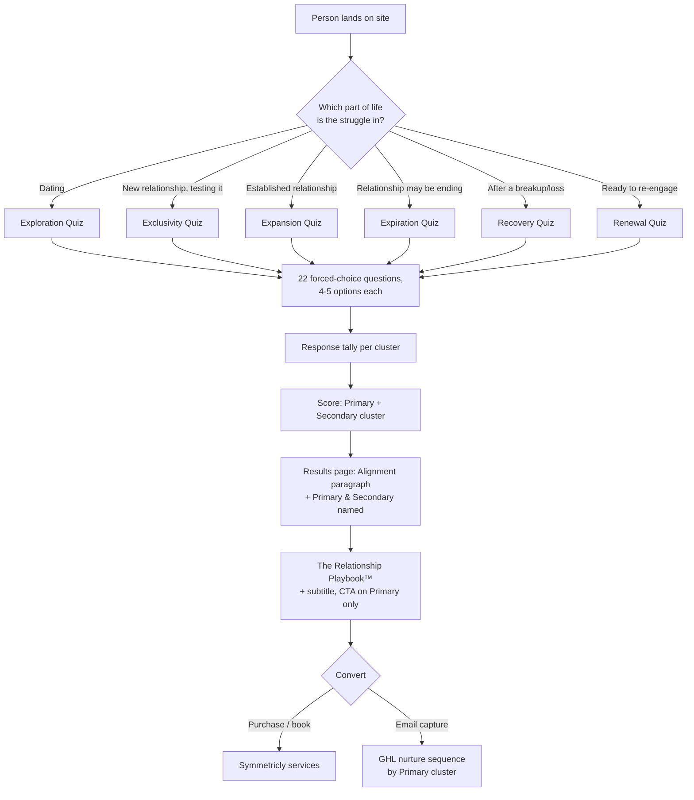

# Relationship Snapshot — Technical Architecture

This maps everything in `RLC_Experience_Clusters.xlsx` (source workbook — see `/data` for seed-ready JSON exports, don't hand-transcribe from Excel) onto your existing stack (Next.js/TypeScript, Supabase, Netlify). Nothing here requires new infrastructure — it's new tables, new routes, and a scoring function on top of what you've already got.

---

## 1. The flow, end to end



---

## 2. Data model (Supabase / Postgres)

This is a direct port of the workbook's tabs into tables. Five tables cover the whole system.

```sql
-- ============================================================
-- 1. CLUSTERS — one row per Cluster Framework entry (26 rows)
-- ============================================================
create table snapshot_clusters (
  id smallint primary key,                 -- 1-26, matches the workbook
  name text not null,                      -- "Difficulty Feeling Chosen"
  core_challenge text not null,            -- the "in their words" line
  description text not null,               -- backend explanation
  unmet_need text not null,                -- one of the 10 Fundamental Needs
  underlying_fear text not null,
  playbook_subtitle text not null,         -- "For Rebuilding Confidence After..."
  alignment_paragraph text not null,       -- shown to the person in their report
  content_pillars jsonb not null,          -- array of 4 strings, backend use
  is_assessable boolean not null default true  -- FALSE for Clusters 2 & 17
);

-- ============================================================
-- 2. ASSESSMENTS — one row per phase quiz (6 rows)
-- ============================================================
create table snapshot_assessments (
  id text primary key,                     -- 'exploration' | 'exclusivity' | 'expansion' | 'expiration' | 'recovery' | 'renewal'
  display_name text not null,              -- "Exploration Assessment"
  entry_prompt text not null,              -- the self-selection copy shown on the picker
  question_count smallint not null default 22
);

-- ============================================================
-- 3. QUIZ ITEMS — the curated 8-10 statements per cluster
-- ============================================================
create table snapshot_quiz_items (
  id uuid primary key default gen_random_uuid(),
  cluster_id smallint references snapshot_clusters(id) not null,
  statement text not null
);

-- which clusters are valid outcomes for which assessment
-- (this is what enforces your minimum-count rule + exclusions)
create table snapshot_assessment_clusters (
  assessment_id text references snapshot_assessments(id),
  cluster_id smallint references snapshot_clusters(id),
  primary key (assessment_id, cluster_id)
);

-- ============================================================
-- 4. QUIZ QUESTIONS — the pre-built 22-question round structure
-- (generated once offline, stored, NOT regenerated per test-taker —
--  see Section 4 for why)
-- ============================================================
create table snapshot_quiz_questions (
  id uuid primary key default gen_random_uuid(),
  assessment_id text references snapshot_assessments(id) not null,
  question_order smallint not null,        -- 1-22
  option_count smallint not null           -- 4 or 5
);

create table snapshot_quiz_question_options (
  id uuid primary key default gen_random_uuid(),
  question_id uuid references snapshot_quiz_questions(id) not null,
  quiz_item_id uuid references snapshot_quiz_items(id) not null,
  option_order smallint not null           -- display order within the question
);

-- ============================================================
-- 5. RESPONSES — one row per test-taker session
-- DECIDED: email is captured only at conversion (CTA click), not at quiz
-- start. user_id is null until they convert and create/claim a portal
-- account; that account is what gives them the PDF later.
-- ============================================================
create table snapshot_quiz_sessions (
  id uuid primary key default gen_random_uuid(),
  assessment_id text references snapshot_assessments(id) not null,
  contact_email text,                      -- null until conversion (CTA click), never required to start the quiz
  user_id uuid references auth.users(id),  -- null until they create/claim a portal account at conversion
  started_at timestamptz not null default now(),
  completed_at timestamptz,
  primary_cluster_id smallint references snapshot_clusters(id),
  secondary_cluster_id smallint references snapshot_clusters(id),
  is_tied boolean not null default false,  -- flags the co-primary edge case
  converted_at timestamptz,                -- when they hit the CTA and captured email
  pdf_storage_path text,                   -- Supabase Storage path to their generated Playbook PDF
  pdf_generated_at timestamptz
);

create table snapshot_quiz_answers (
  session_id uuid references snapshot_quiz_sessions(id) not null,
  question_id uuid references snapshot_quiz_questions(id) not null,
  selected_option_id uuid references snapshot_quiz_question_options(id) not null,
  answered_at timestamptz not null default now(),
  primary key (session_id, question_id)
);
```

**Why questions are pre-generated, not built live:** your round-building logic (balanced cluster appearances, no duplicate statement per question, alternating 4/5 options) is exactly what `build_quiz_v2.py` already does. Run that once per assessment, insert the output into `snapshot_quiz_questions` / `snapshot_quiz_question_options`, and every test-taker gets the same validated 22 questions. Regenerating randomly per session would risk an unbalanced quiz slipping through without the checks you already ran.

---

## 3. Scoring logic

This is the one piece of real application code. Runs when a session is marked complete.

```typescript
// lib/rlc/scoreSession.ts

interface AnswerTally {
  clusterId: number;
  wins: number;
}

async function scoreSession(sessionId: string) {
  const answers = await supabase
    .from('snapshot_quiz_answers')
    .select(`
      selected_option_id,
      snapshot_quiz_question_options!inner(quiz_item_id, snapshot_quiz_items!inner(cluster_id))
    `)
    .eq('session_id', sessionId);

  const tally = new Map<number, number>();
  for (const a of answers.data ?? []) {
    const clusterId = a.snapshot_quiz_question_options.snapshot_quiz_items.cluster_id;
    tally.set(clusterId, (tally.get(clusterId) ?? 0) + 1);
  }

  const ranked = [...tally.entries()]
    .sort((a, b) => b[1] - a[1])
    .map(([clusterId, wins]) => ({ clusterId, wins }));

  const isTied = ranked.length > 1 && ranked[0].wins === ranked[1].wins;

  await supabase.from('snapshot_quiz_sessions').update({
    completed_at: new Date().toISOString(),
    primary_cluster_id: ranked[0]?.clusterId,
    secondary_cluster_id: isTied ? null : ranked[1]?.clusterId,
    is_tied: isTied,
  }).eq('id', sessionId);

  return { primary: ranked[0], secondary: isTied ? null : ranked[1], isTied };
}
```

**The tie case, made concrete:** if `isTied` is true, your two options from the workbook's methodology note are: (a) show both as co-Primary with two Playbook CTAs, or (b) fire one extra head-to-head question between just the tied clusters' remaining unused statements before finalizing. Given Expiration and Recovery are your smallest quizzes (most likely to tie), I'd build (b) — a `resolveTie(sessionId)` function that pulls one more question from `snapshot_quiz_items` for just those two clusters — since a shared-Primary result is a weaker product moment than a clean single answer.

---

## 4. The results page

Route: `/results/[sessionId]` (or embed in the quiz flow as a final step, no separate URL if you don't want results shareable/bookmarkable).

```
┌─────────────────────────────────────────┐
│  [Alignment paragraph for Primary]        │  ← snapshot_clusters.alignment_paragraph
│                                            │
│  You may also relate to: [Secondary name] │  ← short, no CTA, just named
│                                            │
│  ┌───────────────────────────────────┐   │
│  │  The Relationship Playbook™        │   │  ← snapshot_clusters.playbook_subtitle
│  │  [Primary's subtitle]              │   │
│  │                                     │   │
│  │  [Get Your Playbook →]  ← CTA      │   │  ← ONLY points at Primary
│  └───────────────────────────────────┘   │
└─────────────────────────────────────────┘
```

The query for this page is one join:

```typescript
const { data: session } = await supabase
  .from('snapshot_quiz_sessions')
  .select(`
    primary_cluster_id, secondary_cluster_id, is_tied,
    primary:snapshot_clusters!primary_cluster_id(*),
    secondary:snapshot_clusters!secondary_cluster_id(*)
  `)
  .eq('id', sessionId)
  .single();
```

---

## 5. Product decisions — resolved

**A. Playbook delivery: PDF, accessed through a client portal.**
Requires a real account, not just an anonymous session — `snapshot_quiz_sessions.user_id` links to Supabase Auth once someone converts. Two implementation paths, worth a deliberate choice rather than defaulting:
  - **Pre-generated (recommended to start):** since Playbook content is per-cluster, not per-person, render all 26 PDFs once (from `clusters.json`'s `playbook_title` / `playbook_subtitle` / `alignment_paragraph`) and just serve the right static file based on `primary_cluster_id`. Cheap, fast, no runtime rendering risk.
  - **Dynamic:** generate per-session at conversion time, which is the only way to personalize it (e.g. insert their name). More moving parts (PDF rendering service, storage write, failure handling). Only worth it if personalization is a real requirement — confirm before building this path.

**B. Email: captured only at conversion, not at quiz start.**
`contact_email` and `user_id` on `snapshot_quiz_sessions` both stay null through the entire quiz. This is already reflected in the schema above. Tradeoff worth knowing: you lose visibility into who abandons a quiz partway through, since there's no identifier until conversion — if that data matters later, an anonymous session cookie/localStorage ID would let you at least count abandonment without capturing PII.

**C. This replaces the existing 15-item Snapshot (now RPI) on the public site.**
Not just a swap — a checklist, since real marketing infrastructure is currently wired to the old quiz:
  - [ ] Audit the existing GHL webhook, Meta Pixel event, and Google Ads conversion action currently firing on old-quiz completion — repoint each at this system's completion event, don't leave them firing on a retired quiz
  - [ ] Decide the old quiz's public URL fate: 301 redirect to the new picker, or fully removed from nav
  - [ ] The old quiz's *code and data are not deleted* — RPI is getting repurposed for the future Relationship Profile™/clinical build, so preserve it, just unpublish it from public-facing routes
  - [ ] Existing Healthy/Mid/Distressed GHL nurture tracks were built against the old quiz's 5-dimension score — they don't map cleanly onto 26 clusters 1:1, so this needs an explicit remapping decision (e.g. new nurture tracks per cluster, or per-phase, not a forced fit into the old 3-tier structure) before GHL automation goes live on the new system

**D. Secondary gets a trimmed paragraph, not just a name.**
Added as `secondary_blurb` on every cluster record in `clusters.json` — the clean opening sentence of each cluster's full `alignment_paragraph`, verified individually rather than truncated blindly (one, Cluster 5, had a sentence-boundary bug from an embedded question mark that got caught and fixed before export). Results page shows Primary's full `alignment_paragraph` + Playbook + CTA, and Secondary's `secondary_blurb` alone, no CTA.

---

## 6. Suggested build order

1. **Schema migration** (Section 2, now including portal auth + PDF fields) — mechanical, generate the actual Supabase migration file plus a seed script that loads the 4 JSON files in `/data` directly. Do not hand-transcribe from the Excel workbook.
2. **One assessment end-to-end** (Exploration — biggest, most-tested) — picker → quiz → score → results page, before building the other 5.
3. **Scoring + tie-break function**, tested against the pre-built question sets.
4. **Remaining 5 assessments** — same components, just different `assessment_id`.
5. **RPI migration checklist** (Section 5C) — do this alongside step 2, not after, since the old quiz's ad infrastructure will misfire the whole time both systems technically exist on the site.
6. **Playbook PDF generation** — start with the pre-generated/static path (Section 5A) unless personalization is a confirmed requirement.
